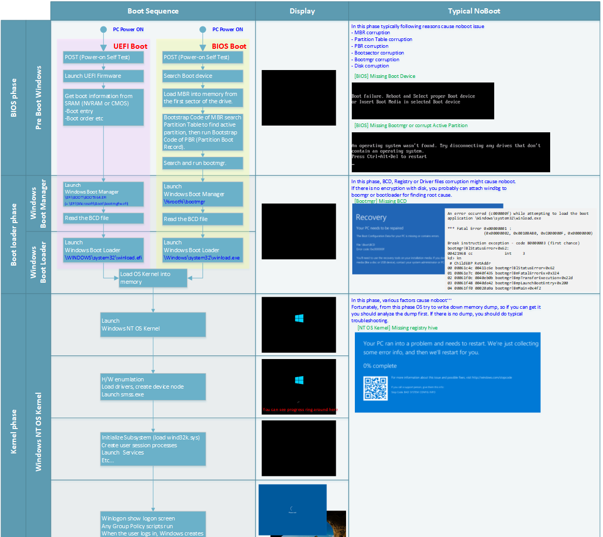

## Tutorials

utils

[Wireguard VPN on ubuntu 20.04](wireguardubuntu2004.md)

[MarkDown GitHub](https://docs.github.com/pt/get-started/writing-on-github/getting-started-with-writing-and-formatting-on-github)

[Encaminhamento de Portas com UFW](EncaminhamentoPortasUFW.md)

Image(Error Fix) Helps

